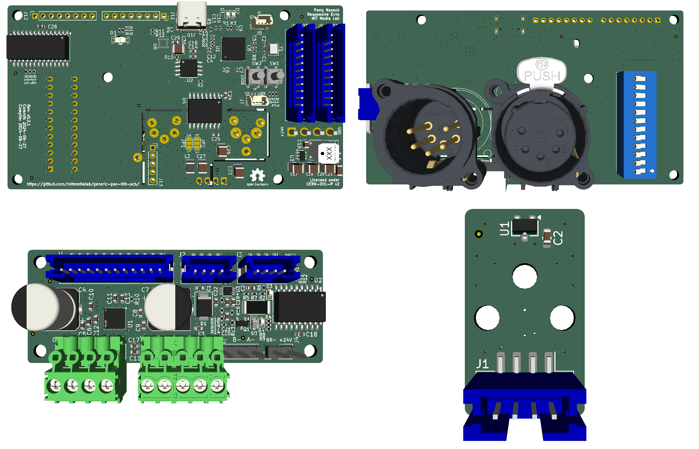

Generic Pan Tilt PCB
====================

This repository contains the KiCAD source files for the printed circuit boards in the Generic Pan Tilt.



For each Generic Pan Tilt you will need:
- 1x generic-pan-tilt-pcb
- 2x generic-pan-tilt-motor-pcb
- 1x generic-pan-tilt-home-sensor-pcb

Schematic PDFs, gerbers, bills of materials (including common vendor part numbers), and 3D models may be generated by running KiBot in each directory.

Please note that not all part 3D models are included in this repository due to licensing restrictions.


## License Notice

This project is licensed under the CERN Open Hardware License Version 2 -
Permissive license.

```
Copyright (c) 2024-2025 MIT Media Lab
All rights reserved.

This source describes Open Hardware and is licensed under the CERN-OHL-P v2
You may redistribute and modify this documentation and make products using it
under the terms of the CERN-OHL-P v2 (https:/cern.ch/cern-ohl).
This documentation is distributed WITHOUT ANY EXPRESS OR IMPLIED WARRANTY,
INCLUDING OF MERCHANTABILITY, SATISFACTORY QUALITY AND FITNESS FOR A PARTICULAR
PURPOSE. Please see the CERN-OHL-P v2 for applicable conditions

A copy of the CERN-OHL-P v2 license may also be found in the LICENSE file in the
root directory of this source tree.

SPDX-License-Identifier: CERN-OHL-P-2.0
```
